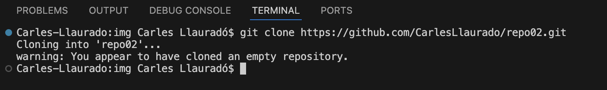

# Exercici 2
## Exercici 2.1
Creamos repositorio remoto en github

***

## Exercici 2.2

***

## Exercici 2.3

***

## Exercici 2.4
### Configuracion Inicial
git config --global user.name "Tu Nombre"   
git config --global user.email "tu@email.com"

### Crear o clonar repositorio
git init    
git clone https://github.com/usuario/repositorio.git

### Guardar cambios
git add .   
git add -A  
git commit -m "Mensaje"
git push origin main

| **Sincroniza con GitHub** | **Ver el estado repositorio** |
|---------------------------|-------------------------------|
| git push                  | git status                    |
| git pull                  | git log                       |
